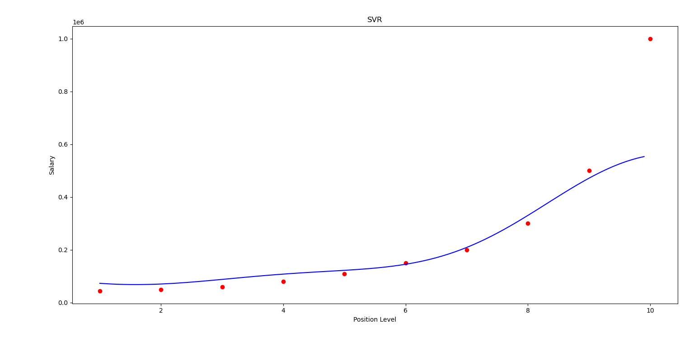

# Support Vector Regression (SVR) for Salary Prediction

This project demonstrates the use of **Support Vector Regression (SVR)** to predict salaries based on position levels. It utilizes Python and several libraries for data preprocessing, model training, and visualization.

## Project Structure

- **Dataset**: `Position_Salaries.csv`
  - Contains two main columns: `Position Level` and `Salary`.
- **Code**: The implementation is done in a Jupyter Notebook.
- **Goal**: Predict the salary for a given position level (e.g., 6.5).

## Workflow

1. **Import Libraries**: Load necessary Python libraries.
2. **Load Dataset**: Read the CSV file and split it into features (`X`) and target variable (`y`).
3. **Preprocessing**:
   - Reshape `y` to ensure compatibility with the model.
   - Standardize `X` and `y` using `StandardScaler`.
4. **Train Model**:
   - Use `SVR` with an RBF kernel for training the regression model.
5. **Prediction**:
   - Predict salary for a given position level (e.g., 6.5).
6. **Visualization**:
   - Plot the actual data points and the model's predictions.

## Results

- The model predicts the salary for position level `6.5` and visualizes the results, including:
  - Actual salary data as red points.
  - Predicted salary curve as a blue line.

## Key Features

- Uses SVR for non-linear regression tasks.
- Implements data standardization for improved model performance.
- Includes data visualization to compare predictions with actual data.

## Example Prediction

To predict the salary for position level `6.5`:
```python
scaler_y.inverse_transform(regressor.predict(scaler_X.transform([[6.5]])).reshape(-1, 1))
```
## Visualization

The notebook visualizes:

- Scatter plot of actual salary data.
- Predicted regression line over the input range.

